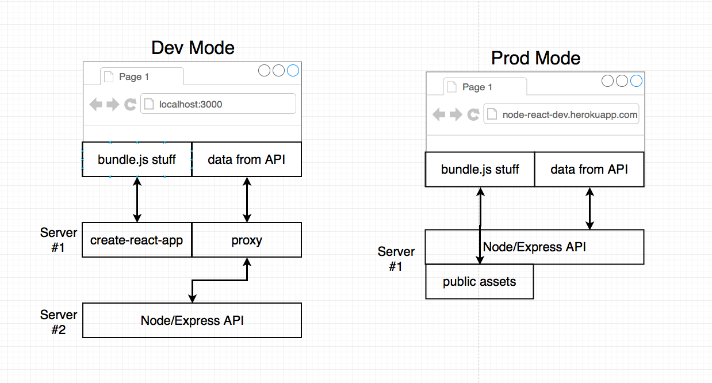
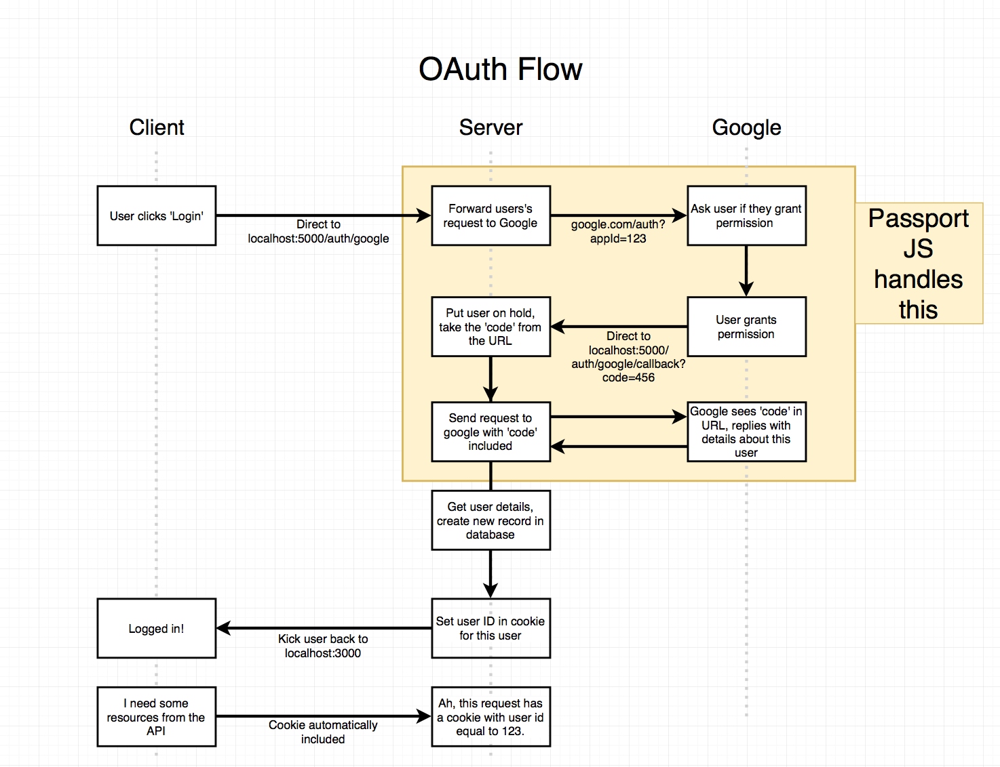
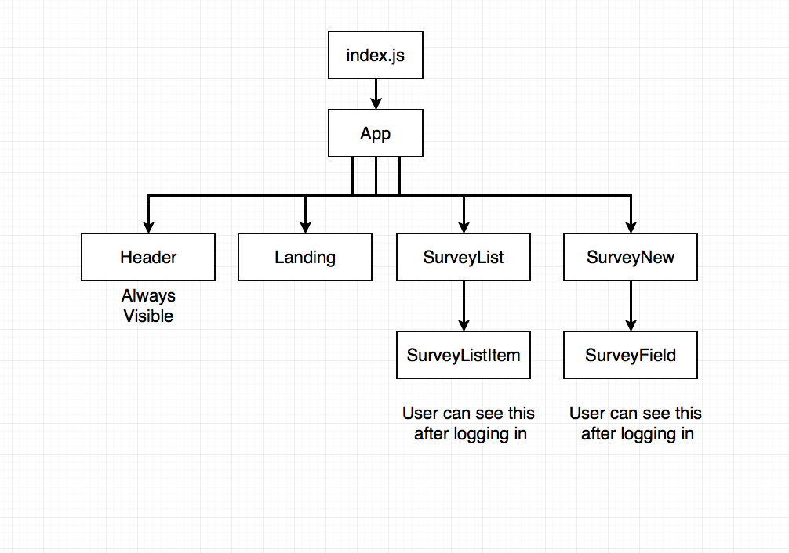
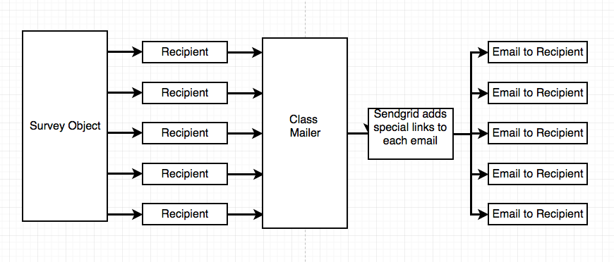

# Email-Survey Project
1. This web app can send an email for a simple yes/no question and see if recipients responded yes/no.
2.


## How to Test
1. live demo: https://node-react-dev.herokuapp.com

## The App's Work Flow and Tech Stack
1. User signs up via Google OAuth `Express server + MongoDB + PassportJS`
2. User pays for email credits via stripe `Stripe + MongoDB`
3. User creates a new 'campaign' `React + Redux`
4. User enters list of emails to send survey to `React + Redux + Redux Form`
5. We send email to list of surveyees `Email Provider`
6. Surveyees click on link in email to provide feedback `Email Provider + Express + Mongo`
7. We tabulate feedback `MongoDB`
8. User can see report of all survey responses `Mongo + React + Redux`


## Client - Server Architecture
1. In development mode, 2 servers run for both client and server. In production mode, 1 server runs.
2. Client route requests gets redirected to Server side with proxy settings.  



## OAuth Flow
1. PassportJS handles OAuth flow, cookieSession handles Cookie



## Basic Client Side Component Hierarchy



## DB Survey Schema
1. Survey collection has recipients subdocument and has a reference to User collection

```
const surveySchema = new Schema({
     title: String,
     ...
     recipients: [RecipientSchema],
     ...
     _user: {type: Schema.Types.ObjectId, ref: 'User'},
     ...
});
```

## Sendgrid Email Flow
1. Survey Object is passed to Mailer class, then the Mailer class sends emails to recipients putting tracking logic into the emails. 




## Deployment Flow

1. `Push to Github` ->
2. `Push to CI` ->
3. `CI Run tests and other tasks` ->
4. `CI deploy the code to Heroku` ->
5. `Heroku builds the project`

## Credits
The architecture of this app, diagrams and much of code was from Stephen Grider's Udemy courses ['Node with React'](https://www.udemy.com/node-with-react-fullstack-web-development/learn/v4/t/lecture/7605110?start=165), [Node Advanced](https://www.udemy.com/advanced-node-for-developers/learn/v4/t/lecture/9647118?start=180)
